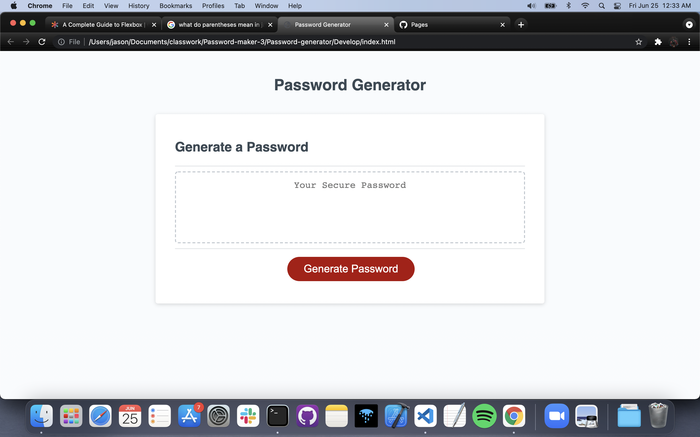
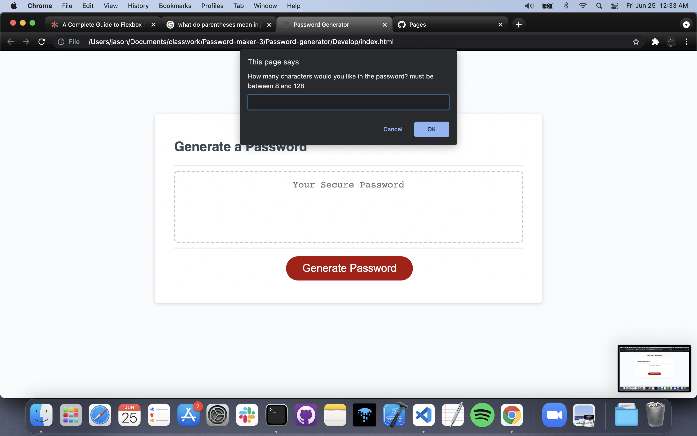
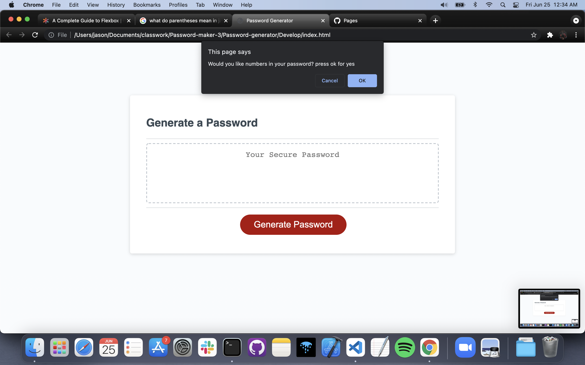
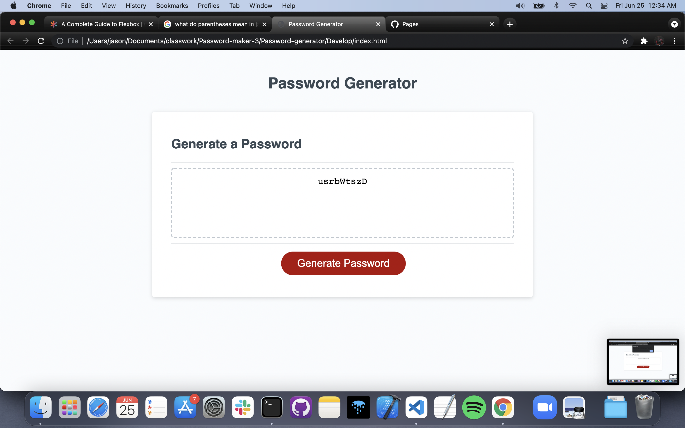

<h1 align="center">Password-generator</h1> 
  
[LinkedIn]: https://www.linkedin.com/in/jason-barrera-ramirez-b2a473204/

[MIT]: https://choosealicense.com/licenses/mit/
## Summary
This a front-end project that uses HTML, CSS, and JS in order to generate passwords based on criteria selected from the user.
## Table of Contents
- [Usage](#usage)
- [Credits](#credits)
- [License](#license)
- [Technologies](#technologies)
- [Future development](#future-development)
- [How to contribute](#how-to-contribute)
- [Questions](#questions)
- [Link](#link)

## Usage
In order to begin generating passwords you must first click the generate password button. After you click a series of alerts pop up and you must select which type of characters you would like in your password. Once this is completed your password will appear in the text field and you then can copy and paste in order to use as you wish.
### Start screen

### Length choice 

### Include numbers option

### Generated password

## Credits
Jason Barrera-Ramirez  
[][LinkedIn]  
## License
This Project is covered by the [MIT] license
## Technologies
[html]: https://developer.mozilla.org/en-US/docs/Web/HTML
[css]: https://developer.mozilla.org/en-US/docs/Web/CSS
[JS]: https://developer.mozilla.org/en-US/docs/Web/JavaScript
[][html]
[][JS]
[][css]  
## Features
This project uses Javascript in order to generate a password by selecting a random value from a set of arrays for a set length chosen by the user.
## Future Development
A path this project is headed is being able to allow more user input in the creation of the password so the password can be more personal and be used for personal accounts and be memorable to the user.
## How to Contribute
Fork the Repo and make a pull request for code to be reviewed and considered for merge to main branch.
## Questions
If there are any questions about the project get in contact with me at my [Email](mailto:jason1287712@gmail.com)
## Link 
This is the link to the live site: [Github](https://jbramirez03.github.io/Password-generator/)
